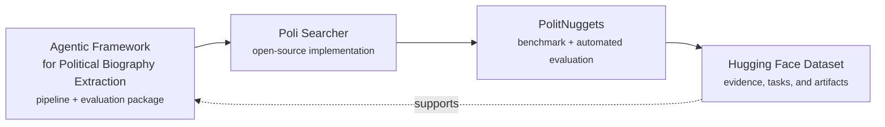

Poli Searcher is an agentic research pipeline for building transparent political-elite biography data from heterogeneous web sources. It connects recursive search and evidence synthesis with downstream structured coding, so large language models can retrieve, curate, and evaluate political facts at scale.

The starting point is the agentic framework for political biography extraction: it defines the search-synthesis-coding pipeline and builds a complete evaluation package around political elite biographies. PolitNuggets then sharpens that evaluation problem for search agents by specifying the benchmark, enhancing the evidence package, and proposing an automated evaluation method. Its selection for ACL 2026 reflects recognition from the computer science community.

## Project Map

## Resources

- [Agentic Framework for Political Biography Extraction](https://arxiv.org/abs/2603.18010): the methodological foundation for extracting political elite biographies with a search-synthesis-coding pipeline.
- [PolitNuggets: Benchmarking Agentic Discovery of Long-Tail Political Facts](https://arxiv.org/abs/2605.14002): the ACL 2026 benchmark and automated evaluation framework for search agents.
- [Poli Searcher GitHub repository](https://github.com/yifeifrank/poli_searcher): the companion implementation for the deep-research/search-agent pipeline.
- [PolitNuggets dataset on Hugging Face](https://huggingface.co/datasets/frankyifei/politnuggets): the public dataset and evaluation artifacts.

## Coming Soon

- Claude Code adaptation for agentic political-search workflows.
- Support for search over a local database.

## Related Papers




